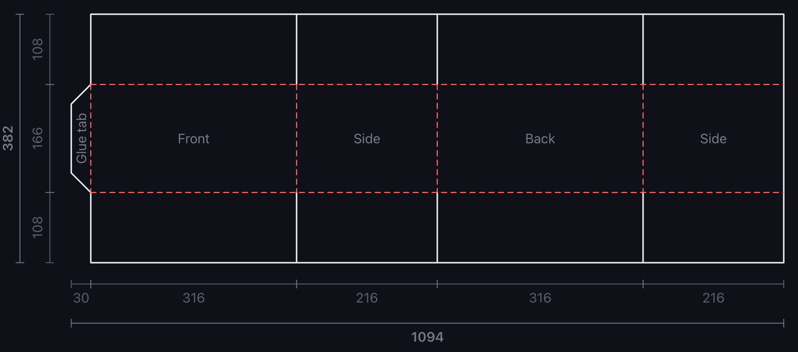

# Carton

Generates the flat cut-and-fold layout for a regular slotted container (RSC) from the
interior dimensions you need to protect, and exports it as a 1:1 millimetre SVG.



```sh
pnpm install
pnpm dev
```

## Inputs

| Input               | Effect                                                         |
| ------------------- | -------------------------------------------------------------- |
| Interior L × W × H  | Clear space required inside the damping liner                  |
| Cardboard thickness | One wall; two walls are added to each axis                     |
| Damping thickness   | Liner on all six interior faces; two layers added to each axis |
| Glue tab            | Optional left-edge tab, with its own width                     |

Panel dimensions are therefore

```
L = interiorLength + 2 × damping + 2 × cardboard
W = interiorWidth  + 2 × damping + 2 × cardboard
H = interiorHeight + 2 × damping + 2 × cardboard
```

The sheet runs `[glue tab] [front] [side] [back] [side]` left to right, with a row of flaps
above and below.

Every flap is cut to the same height, `min(L, W) / 2`. A flap reaches across the axis
perpendicular to the panel it hangs from — the front and back flaps span `W`, the side flaps
span `L` — so sizing off the shorter axis lets that pair butt exactly in the middle while the
other pair stops `|L − W|` short. Halving the longer axis instead would drive the short-axis
flaps into each other.

With the glue tab switched off, its geometry is removed entirely and the left edge of the
front panel becomes a cut rather than a fold.

## Output

Black solid lines are cuts, red dashed lines are folds. The **Download SVG** button
serialises the same component the preview renders, so the file cannot drift from the
drawing on screen — it only swaps screen-relative stroke widths for absolute millimetre
ones and stamps a physical `width`/`height` on the root element. Dimension annotations are
included when the toggle is on.

Every input is mirrored into the URL query string, so a configuration can be bookmarked or
shared. **Share link** copies the current URL to the clipboard.

## Layout

```
src/lib/geometry.ts     Pure geometry — params in, structured cuts/folds/panels out
src/lib/exportSvg.ts    Standalone SVG serialisation and download (lazy-loaded)
src/lib/urlState.ts     Query-string encoding of the parameters
src/components/         FlatLayout (the SVG), ControlPanel, NumberField
```

`pnpm lint` runs Oxlint; `pnpm build` type-checks and bundles.
