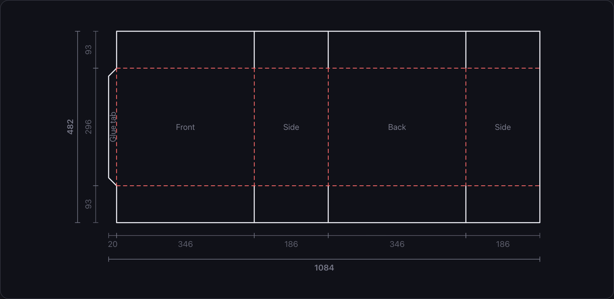
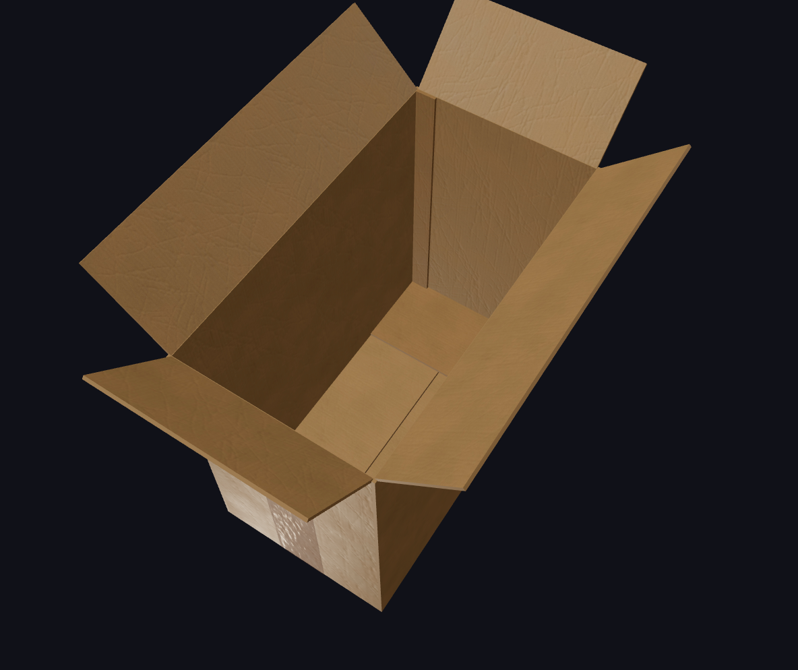

# Carton

Generates the flat cut-and-fold layout for a regular slotted container (RSC) from the
interior dimensions you need to protect, exports it as a 1:1 millimetre SVG, and shows the
assembled box in 3D.

| Layout                            | Render                              |
| --------------------------------- | ----------------------------------- |
|  |  |

```sh
pnpm install
pnpm dev
```

## Inputs

| Input               | Effect                                                         |
| ------------------- | -------------------------------------------------------------- |
| Interior L × W × H  | Clear space required inside the damping liner                  |
| Cardboard thickness | One wall; two walls are added to each axis                     |
| Damping thickness   | Liner on all six interior faces; two layers added to each axis |
| Glue tab            | Optional left-edge tab, with its own width                     |

Panel dimensions are therefore

```
L = interiorLength + 2 × damping + 2 × cardboard
W = interiorWidth  + 2 × damping + 2 × cardboard
H = interiorHeight + 2 × damping + 2 × cardboard
```

The sheet runs `[glue tab] [front] [side] [back] [side]` left to right, with a row of flaps
above and below.

Every flap is cut to the same height, `min(L, W) / 2`. A flap reaches across the axis
perpendicular to the panel it hangs from — the front and back flaps span `W`, the side flaps
span `L` — so sizing off the shorter axis lets that pair butt exactly in the middle while the
other pair stops `|L − W|` short. Halving the longer axis instead would drive the short-axis
flaps into each other.

With the glue tab switched off, its geometry is removed entirely and the left edge of the
front panel becomes a cut rather than a fold.

## Output

Black solid lines are cuts, red dashed lines are folds. The **Download SVG** button
serialises the same component the preview renders, so the file cannot drift from the
drawing on screen — it only swaps screen-relative stroke widths for absolute millimetre
ones and stamps a physical `width`/`height` on the root element. Dimension annotations are
included when the toggle is on.

Every input is mirrored into the URL query string, so a configuration can be bookmarked or
shared. **Share link** copies the current URL to the clipboard.

## 3D view

The **3D** tab renders the folded box, orbitable by pointer or touch: walls up, bottom flaps
folded and lapped in the right order, top flaps splayed 45° open, glue tab against the inside
of the wall it closes against, and a strip of sealing tape along the bottom seam and halfway
up the two walls it ends at.

It reads the same `Layout` the flat drawing does, so the two can never disagree — the model
is just those panel rectangles placed in space. Which pair of bottom flaps ends up on the
outside follows from `min(L, W) / 2` above, and flips with the footprint.

Everything 3D is code-split: `three`, `@react-three/fiber`, `@react-three/drei` and the
paper and tape scans only download when the tab is first opened, so the flat view and the
SVG export stay unaffected. WebGL support is probed before any of that is fetched, and a
machine that cannot render gets a notice instead.

## Layout

```
src/lib/geometry.ts     Pure geometry — params in, structured cuts/folds/panels out
src/lib/model3d.ts      Pure fold — the same layout as positioned 3D slabs
src/lib/exportSvg.ts    Standalone SVG serialisation and download (lazy-loaded)
src/lib/urlState.ts     Query-string encoding of the parameters
src/lib/webgl.ts        WebGL capability probe, free of any three.js import
src/components/         FlatLayout (the SVG), Box3D (the canvas), ControlPanel, Tabs
public/                 Paper and tape texture scans
```

`pnpm lint` runs Oxlint; `pnpm build` type-checks and bundles.
